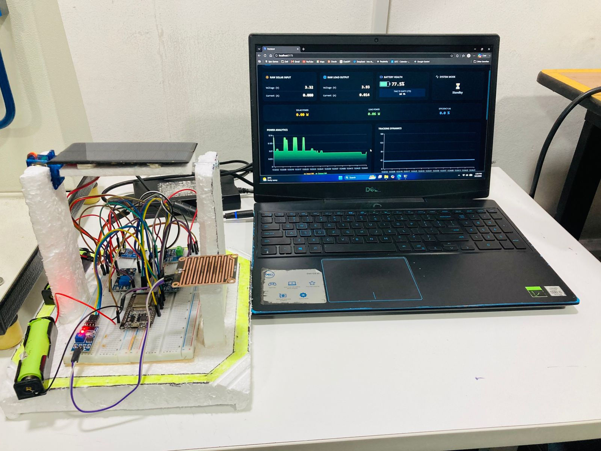
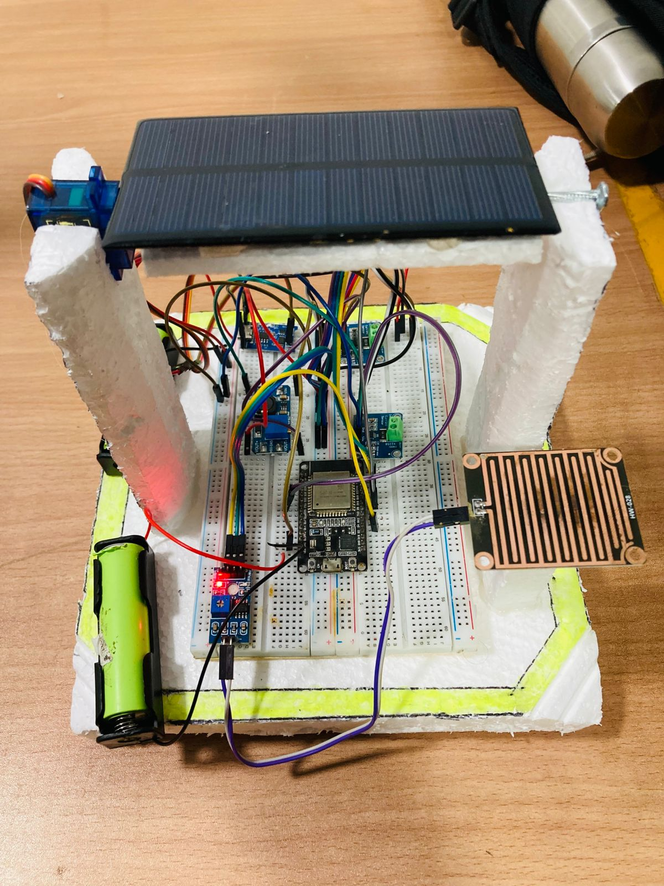
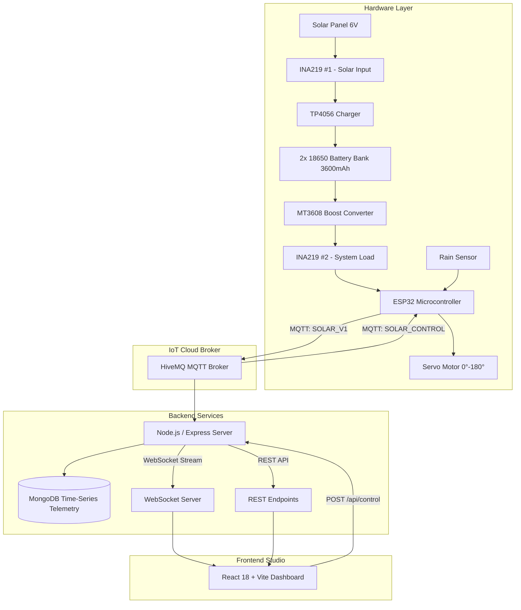

# ☀️ Intelligent IoT Solar Tracking System & Telemetry Studio

An autonomous, dual-core ESP32-powered solar tracking system with precision power telemetry and an interactive, real-time full-stack web dashboard. The system dynamically tracks the sun, protects hardware during inclement weather with automated rain washing, stows flat at night, and provides live power analytics and bi-directional remote control via MQTT and WebSockets.

---

## 📸 Developed Project & System in Action

<div align="center">

### Complete System Running Live Telemetry


*Physical solar tracking prototype operating synchronously with the live React Telemetry Studio dashboard.*

<br/>

### Hardware Prototype & Circuit Architecture


*ESP32 dual-core node, dual INA219 current/voltage monitors, TP4056 linear charger, MT3608 boost converter, dual 18650 Li-ion battery bank, servo articulation mount, and rain detection plate.*

</div>

---

## ⚡ Key Highlights

- **Dual-Source Precision Telemetry:** Dual INA219 I2C monitors stream raw Solar Input ($V_{in}, A_{in}, P_{in}$) and Load/Battery Output ($V_{out}, A_{out}, P_{out}$) with zero synthetic simulation.
- **Autonomous Multi-Mode Logic:**
  - ☀️ **Active Sun Tracking:** Dynamic astronomical hour-to-angle interpolation ($0^\circ - 180^\circ$) to maximize photon collection.
  - 🌧️ **Rain Wash / Safe Staging Mode:** Automatically stages the panel to $60^\circ$ upon precipitation detection to wash away accumulated dust and shed water safely.
  - 🌙 **Night Aerodynamic Stowage:** Automatically stows the panel flat ($90^\circ$) to minimize wind resistance and conserve energy during zero-irradiance hours.
- **Battery Intelligence & Autonomy:**
  - Precise Li-ion 18650 State of Charge (SoC%) mapping from $3.0\text{V}$ ($0\%$) to $4.2\text{V}$ ($100\%$) for a $3600\text{mAh}$ dual-cell configuration.
  - Dynamic **Time-to-Empty (TTE)** and **Time-to-Full (TTF)** runtime countdown calculator.
- **Full-Stack Glassmorphism Dashboard:**
  - Real-time WebSockets streaming updates instantly without page polling.
  - Dual Area Charts for input generation vs. system consumption.
  - Daily Energy Harvest bar chart ($Wh$) integrated using the trapezoidal rule over time-series data.
  - Remote MQTT terminal with manual servo slider and quick-command triggers (`CLEAN`, `SLEEP`, `REBOOT`).

---

## 🏗️ System Architecture



---

## 🧰 Hardware Bill of Materials

| Component | Specification / Description | Role |
| :--- | :--- | :--- |
| **Microcontroller** | ESP32-WROOM-32 (Dual-Core 240MHz) | Core 0: MQTT & NTP; Core 1: Sensor & Servo loop |
| **Solar Panel** | 6V Monocrystalline PV Panel | Renewable power generation |
| **Power Monitors** | 2x INA219 (High-side I2C current & voltage sensors) | Sensor 1: Solar input; Sensor 2: System load |
| **Energy Storage** | 2x 18650 Li-ion 3.7V 1800mAh (3600mAh parallel) | Buffer & backup battery power |
| **Charger Module** | TP4056 Linear Li-ion Charger with protection | Constant-current / constant-voltage charging |
| **Boost Converter** | MT3608 DC-DC Step-Up Converter | Regulates battery rail to stable logic voltage |
| **Actuator** | Micro Servo (SG90 / MG90S) | Single-axis solar tracking articulation |
| **Rain Sensor** | Resistive Rain Detection Sensor (HW-028) | Precipitation detection for cleaning cycle |

---

## 💻 Software Stack

### Frontend
- **Framework:** React 18 with Vite
- **Styling:** Tailwind CSS (Dark Glassmorphism UI)
- **Visualizations:** Recharts (Power Analytics Area Charts, Servo Tracking Dynamics Step Charts, Daily Yield Bar Charts)
- **Icons:** Lucide React
- **Networking:** Native WebSocket client with auto-reconnection and REST client

### Backend
- **Runtime:** Node.js (ES Modules)
- **Framework:** Express.js
- **Database:** MongoDB (Time-Series collection partitioned by timestamp with metadata)
- **Messaging:** MQTT (`mqtt.js` with forced IPv4 resolution) & WebSockets (`ws`)
- **Algorithms:** Trapezoidal numerical integration for Watt-hour ($Wh$) energy harvesting

---

## 📊 Live Metrics & Derived KPIs

1. **Solar Input Power ($P_{in}$):**
   $$P_{in} = V_{in} \times I_{in} \quad (\text{Watts})$$

2. **System Load Consumption ($P_{out}$):**
   $$P_{out} = V_{out} \times I_{out} \quad (\text{Watts})$$

3. **System Conversion Efficiency ($\eta$):**
   $$\eta = \left( \frac{P_{out}}{P_{in}} \right) \times 100\%$$

4. **Battery State of Charge (SoC%):**
   $$\text{SoC} = \left( \frac{V_{out} - 3.0\text{V}}{4.2\text{V} - 3.0\text{V}} \right) \times 100\%$$

5. **Autonomy Calculator (TTE / TTF):**
   $$\text{TTE (hours)} = \frac{C_{\text{usable}} \text{ (mAh)}}{|I_{net}| \text{ (mA)}} \quad \text{when } I_{net} < 0$$
   $$\text{TTF (hours)} = \frac{C_{\text{remaining}} \text{ (mAh)}}{I_{net} \text{ (mA)}} \quad \text{when } I_{net} > 0$$

6. **Daily Energy Yield ($Wh$):**
   $$E_{\text{daily}} = \frac{1}{3600} \sum_{i=1}^{n} \left( \frac{P_i + P_{i-1}}{2} \right) \times \Delta t_i \quad (\text{Watt-hours})$$

---

## 🚀 Getting Started

### Prerequisites
- [Node.js](https://nodejs.org/) (v18 or later)
- [MongoDB Community Server](https://www.mongodb.com/try/download/community) installed and running locally on `localhost:27017`
- Git

### 1. Clone the Repository
```bash
git clone https://github.com/DaniduZe/IoT-Solar-Tracking-System.git
cd IoT-Solar-Tracking-System
```

### 2. Backend Setup
```bash
cd backend
npm install
```
Create a `.env` file in the `backend/` directory (or copy from `.env.example`):
```env
PORT=5000
MONGO_URI=mongodb://127.0.0.1:27017
MQTT_BROKER=mqtt://broker.hivemq.com:1883
```
Start the backend service:
```bash
node server.js
```
The server will initialize the MongoDB Time-Series collection, connect to HiveMQ via IPv4, and start WebSocket broadcasting on port `5000`.

### 3. Frontend Setup
In a separate terminal:
```bash
cd frontend
npm install
npm run dev
```
Open your browser at `http://localhost:5173` to access the Solar Telemetry Studio.

---

## 📡 API Reference

### Telemetry Endpoints
- **`GET /api/telemetry`**
  - Returns the latest 100 recorded sensor telemetry documents sorted chronologically.
- **`GET /api/telemetry/daily`**
  - Computes and returns aggregated daily energy yields ($Wh$) aggregated via MongoDB pipeline.
- **`POST /api/control`**
  - Sends commands or angle overrides to the ESP32 via MQTT topic `SOLAR_CONTROL`.
  - **Payload examples:**
    - Manual Angle Override: `{ "angle": 120 }`
    - Trigger Cleaning Cycle: `{ "command": "clean" }` (sets panel to $60^\circ$)
    - Low-Power Deep Sleep: `{ "command": "sleep" }`
    - Remote Reset: `{ "command": "reboot" }`

---

## 🔒 Security & Confidentiality

- No private Wi-Fi SSIDs, authentication passwords, personal tokens, or API credentials are included in this public repository.
- All environment configurations rely on standard local defaults or customizable `.env` templates.

---

## 📄 License
This project is open-source and available under the [MIT License](LICENSE).
